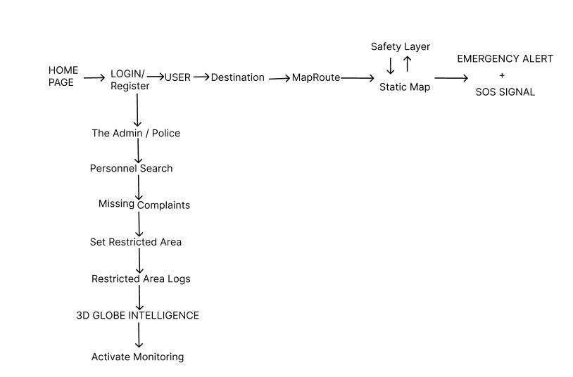

<div align="center">
  
  
  
  
  
</div>

<h1 align="center">🛡️ SmartNav Intelligence & Safety System</h1>

<p align="center">
  <b>A real-time geospatial intelligence, anomaly-detection, and emergency routing ecosystem.</b>
</p>


## 📖 Table of Contents
1. [The Problem SmartNav Solves](#-the-problem-smartnav-solves)
2. [How It Solves the Problem](#-how-it-solves-the-problem)
3. [What Differentiates SmartNav from Others?](#-what-differentiates-smartnav-from-others)
4. [System Architecture Flow](#-system-architecture-flow)
5. [Detailed Page-by-Page Explanation](#-detailed-page-by-page-explanation)
   - [User Pages (Citizen Interface)](#user-pages-citizen-interface)
   - [Police Dashboard (Command & Control)](#police-dashboard-command--control)
6. [Core Technologies & Their Roles](#-core-technologies--their-roles)
7. [Local Deployment Setup (A-Z Guide)](#-local-deployment-setup-a-z-guide)

---

## 🚨 The Problem SmartNav Solves

Standard navigation software (Google Maps, Apple Maps, Waze) operates on a singular primary objective: **optimize for the fastest route (time efficiency)**. While excellent for commuting, this model completely ignores **geospatial safety constraints** and dynamic real-time hazards:

1. **Blindly Routing into Danger:** Traditional systems will route users directly through active protest zones, areas experiencing high crime spikes, flash flooding, or civil unrest simply because that road has less traffic.
2. **Outdated Crime/Incident Databases:** Most crime-mapping apps pull from static governmental database dumps published monthly or annually. They lack context on a threat that occurred 30 minutes ago.
3. **No Emergency Responder Integration:** If a traveler gets stranded, encounters an accident, or loses cellular connection in a dangerous zone, standard maps do not automatically packages emergency telemetry and relay it to local law enforcement.

---

## 💡 How It Solves the Problem

SmartNav shifts the paradigm from *speed-centric routing* to **safety-centric routing** by acting as an intelligent bridge between active citizens and law enforcement:

* **Dynamic Safety Layer Routing:** Instead of just finding the shortest path, our routing engine assigns dynamic `dangerWeights` to different sectors/streets using spatial polygons (e.g., assembly boundaries). It calculates the safest detour around danger zones.
* **Automated Web-Scraping Pipeline:** Python scripts run in the background, continuously scraping regional news web portals, public incident feeds, and social alert systems to update the risk heatmap in near real-time.
* **Geo-Fencing and Breach Detection:** The system registers digital borders ("Geo-Fences"). If a user crosses into a high-risk or restricted area, the system flags the breach and updates the central dashboard immediately.
* **Asynchronous SOS Dispatch:** In high-danger moments, the client generates a package of user coordinates, profile information, and routes, and dispatches it via physical cellular SMS networks (Twilio) and Webhooks to law enforcement.

---

## ✨ What Differentiates SmartNav from Others?

| Feature | Standard Nav (Google/Waze) | Static Crime Maps | SmartNav |
| :--- | :---: | :---: | :---: |
| **Optimization Focus** | Shortest Time | None (Data View Only) | **Maximum Safety & Detours** |
| **Data Recency** | Traffic-only | Static/Stale (Monthly/Annual) | **Real-time (News/Feed Web Scraping)** |
| **Law Enforcement UI** | None | Simple Heatmap | **3D WebGL Tactical Globe Monitor** |
| **Emergency Actions** | Manual share | None | **Auto-SOS Cellular (Twilio) + Webhooks** |
| **Connection Fallback** | Offline map | None | **Simulated Offline Fallback Mode** |

---

## 🔄 System Architecture Flow

  
*(An abstract overview of the SmartNav dispatch sequence)*

The architecture strictly delineates the User client from the Police client, connected asynchronously by the server node logic:
1. **User Side:** Users query routes. The backend requests the Python service to inject the live safety layers. The frontend displays the safe path. If SOS is clicked, the payload is POSTed.
2. **Police Side:** Administrators bypass standard routing and log into the Monitoring Dashboard where real-time user breadcrumbs, restricted breaches, and WebGL representations are rendered.

---

## 📄 Detailed Page-by-Page Explanation

### User Pages (Citizen Interface)
The frontend application serves citizens navigating through potentially unsafe areas.

* #### 1. Home Page (`/`)
  * **Purpose:** The entry portal for the application.
  * **Why it's used:** Introduces the project and allows users to choose between logging in, registering, or identifying as law enforcement.
* #### 2. Login & Register (`/login`, `/register`)
  * **Purpose:** Secure authentication gate.
  * **Why it's used:** Collects user profile details (name, contact number, emergency contacts). This data is vital during emergency dispatches to ensure responders know who they are rescuing.
* #### 3. Profile Page (`/profile`)
  * **Purpose:** User account management.
  * **Why it's used:** Allows users to view their account info, register emergency contact lines, verify coordinates, and securely log out.
* #### 4. Destination Input Page (`/destination`)
  * **Purpose:** Route setup gateway.
  * **Why it's used:** The user inputs their desired source and destination. It triggers API calls to compute the optimal safe path, avoiding active threat clusters.
* #### 5. Map View Page (`/map`)
  * **Purpose:** Active navigation HUD.
  * **Why it's used:** Renders a 2D Leaflet map displaying the safe route. Highlights risk zones via a **Choropleth overlay** (Red/Yellow/Green safety scores). It also features a "Simulate Connection Loss" test button.
* #### 6. Emergency Page (`/emergency`)
  * **Purpose:** SOS & offline safety dashboard.
  * **Why it's used:** Triggers if a connection drop is detected or simulated. It allows the user to immediately dispatch an SOS alert to emergency contacts/police, input local incident reports, or report a false alarm.

---

### Police Dashboard (Command & Control)
Designed for tactical operators and dispatch units to monitor citizen safety.

* #### 1. Main Police Dashboard (`/police`)
  * **Purpose:** The dispatcher control panel.
  * **Why it's used:** Lists all registered users, their current coordinates, and their system state. Officers can lookup profile cards, contact info, and see active distress alerts in real time.
* #### 2. Police Tracking Map (`/police/map`)
  * **Purpose:** Spatial situational awareness.
  * **Why it's used:** Displays a live tracking map plotting coordinates, safe navigation corridors, and incident heat markers. Clicking a user brings up their active navigation path.
* #### 3. Location History Page (`/police/history`)
  * **Purpose:** Forensic route analysis.
  * **Why it's used:** Renders breadcrumbs of past coordinates for a selected user, showing the route they took leading up to an SOS alert or system breach.
* #### 4. CIA-Style Intelligence Monitoring Dashboard (`/police/monitoring`)
  * **Purpose:** Immersive 3D Geospatial Command Center.
  * **Why it's used:** Swaps from flat maps to a **3D WebGL Globe (CesiumJS)**. Operators can monitor macro stats (Avg safety score, active users, alert alerts) and watch a live feed of scraped news incidents. The camera dynamically "flies" to coordinate hashes in real time.
* #### 5. Restricted Geo-Fence Logs (`/police/restricted-logs`)
  * **Purpose:** Compliance and boundary breach tracker.
  * **Why it's used:** Tracks restricted polygons. If a user crosses inside a restricted boundary, the dashboard lists a log entry highlighting the user, exact coordinates of the breach, and time stamp, alerting officers to immediate trespassing events.

---

## 🛠️ Core Technologies & Their Roles

### 1. Frontend Client
* **React 18 + Vite:** Hot-module-reloading UI rendering and dynamic state management.
* **CesiumJS & WebGL:** Powers the 3D Intelligence Globe to map coordinate vectors and polygons.
* **React-Leaflet:** Foundational mapping engine used for 2D Choropleth maps and routing paths.

### 2. Action Backend Server (Node)
* **Node.js & Express 5.x:** ReSTful API layer bridging the frontend client, database, and Python services.
* **Twilio API SDK:** Direct cellular network integration to dispatch emergency SMS payloads.
* **n8n Webhooks:** Backend automation to instantly trigger notifications on active operator screens.

### 3. Intelligence Engine (Python)
* **Python 3 / Flask:** Serves endpoints called by the Express server for calculation requests.
* **BeautifulSoup / Selenium:** Live web scraping modules pulling articles from regional news portals.
* **GeoPandas & NumPy:** Performs mathematical spatial projections matching text addresses to Tamil Nadu boundaries.

---

## 🚀 Local Deployment Setup (A-Z Guide)

> **Prerequisites:** Please ensure you have [Node 18+](https://nodejs.org/en) and [Python 3.10+](https://www.python.org/downloads/) permanently placed in your environment PATH.

### 1. Initialize the Environment Variables
Create a local `.env` inside the `/server` directory:
```env
PORT=5000
DB_HOST=localhost
DB_USER=root
DB_PASS=your_db_password
DB_NAME=db_name 

# Twilio SMS Configs
TWILIO_ACCOUNT_SID=your_twilio_sid
TWILIO_AUTH_TOKEN=your_twilio_token
TWILIO_PHONE=+1XXXXXXXXXX
```

### 2. Install Dependencies
You can install dependencies for all services automatically by running:
```cmd
install_all.bat
```

### 3. Start the Services
Run the batch file in the project root to start the frontend, backend, and Python server in parallel:
```cmd
start_all.bat
```
Once launched, navigate to [http://localhost:5173](http://localhost:5173) in your web browser. 🗺️✨


BY TEAM : TECHROCKERS 

Contributers : 

 FRONTEND AND BACKEND DEVELOPMENT, DATA COLLECTION AND PROCESSING :Lingesh G R, Manojkumar C S,
 RISK ANALYSIS , MAP GENERATION , SOS ALERT SYSTEM DEVELOPMENT: Lohith R, 
 UI DESIGNER : Sharan V.